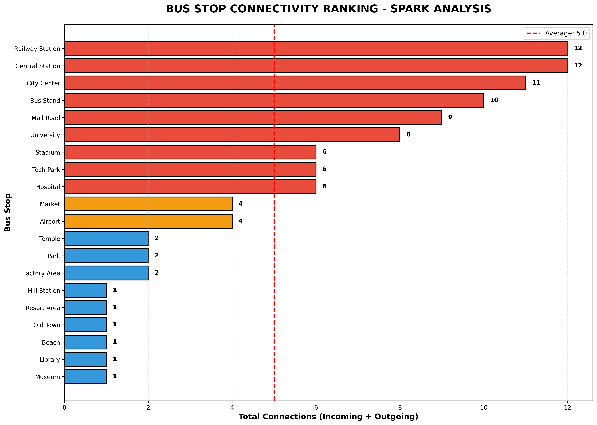
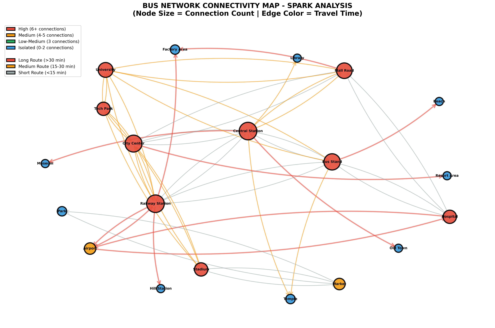

# 🚌 **BusNet360 – Distributed Urban Bus Network Analysis (Apache Spark + NetworkX)**

BusNet360 is a **distributed bus network analysis system** built using **Apache Spark**, designed for scalable processing of urban transportation networks.
This project analyzes **20+ bus stops** and **56 directional routes**, identifies **transport hubs**, detects **isolated stops**, uncovers **connectivity gaps**, and visualizes the complete network through **advanced graph analytics**.

It combines:

* **Apache Spark (PySpark)** → Distributed processing
* **NetworkX** → Graph construction
* **Matplotlib** → Visual analytics
* **Pandas** → Data transformation

---

## 🚀 **Project Features**

### ✔ Distributed Bus Network Analysis

Performs large-scale computation on bus routes, connectivity degrees, route density, and stop accessibility.

### ✔ Directed Graph Construction

Builds a fully directed transport graph with edge attributes such as travel time and bus number.

### ✔ Connectivity & Accessibility Ranking

Identifies:

* Main hub
* Least accessible stops
* Low/medium/high connectivity zones

### ✔ Route Analytics

Computes:

* Longest & shortest routes
* Bus frequencies
* Network density
* Travel time statistics

### ✔ Fully Generated Visualizations

1. **Connectivity Ranking Chart**
   

2. **Bus Network Graph Map (Spark + NetworkX visualization)**
   

3. **Dashboard Screenshot**
   *(Sample UI/Results Dashboard)*
   

---

# 📂 **Project Structure**

```
BusNet360/
│── bus_network_data/
│   ├── bus_stops.csv
│   └── bus_routes.csv
│
│── Images/
│   ├── connectivity_chart_spark.png
│   ├── bus_network_map_spark.png
│   └── Screenshot 2025-11-09 130143.png
│
│── bus_network_analysis_spark.py
│── README.md
```

---

# 🧠 **Technologies Used**

| Component                  | Purpose                                   |
| -------------------------- | ----------------------------------------- |
| **Apache Spark (PySpark)** | Distributed processing & data aggregation |
| **Pandas**                 | Data handling for NetworkX graphs         |
| **NetworkX**               | Graph-based analysis (directed graph)     |
| **Matplotlib**             | Creating visualizations                   |
| **Python 3.8+**            | Base programming language                 |

---

# 📥 **Setup & Installation**

### 1️⃣ Install Python Dependencies

```bash
pip install pyspark pandas networkx matplotlib
```

### 2️⃣ Run the Script

```bash
python bus_network_analysis_spark.py
```

### 3️⃣ Outputs Generated

After execution, the following images will be saved:

```
Images/bus_network_map_spark.png
Images/connectivity_chart_spark.png
```

---

# 🧩 **How It Works**

### **1. Load Bus Network Data**

Spark loads bus stop and route CSV files from the `bus_network_data/` folder.

### **2. Build Directed Graph**

Each stop becomes a **node**
Each bus route becomes a **directed edge** with attributes:

* Travel time
* Bus number

### **3. Compute Connectivity Using Spark**

Spark computes:

* outgoing routes
* incoming routes
* total degree
* accessibility class

### **4. Identify Transport Hubs**

The system detects:

* **Main Hub** (highest degree)
* **Top 5 hubs**
* **Isolated stops (0–2 connections)**

### **5. Route Analytics**

Includes:

* Longest 3 routes
* Shortest 3 routes
* Bus frequency per route
* Network density calculation

### **6. Visualization**

Two major graphs:

* **Network connectivity map**
* **Connectivity ranking chart**

Both saved automatically.

---

# 📊 **Visualization Samples**

### 📌 *1. Connectivity Chart*

Shows the total incoming/outgoing connections for each stop


---

### 📌 *2. Bus Network Map*

Node size = connection count
Edge color = travel time


---

### 📌 *3. Dashboard Screenshot*


---

# 🧾 **Complete Source Code**

Your full PySpark + NetworkX code is included in:

```
bus_network_analysis_spark.py
```

---

# 🏆 **Key Outcomes**

* Successfully identifies city bus transport hubs
* Highlights isolated & low-access regions
* Helps planners improve route coverage
* Provides a scalable approach for large networks (1000+ stops)
* Creates meaningful visualizations for insights

---

# 🤝 **Contributing**

Contributions are always welcome!
Feel free to:

* Open issues
* Propose enhancements
* Submit pull requests

---

# 📜 **License**

This project is licensed under the MIT License.
